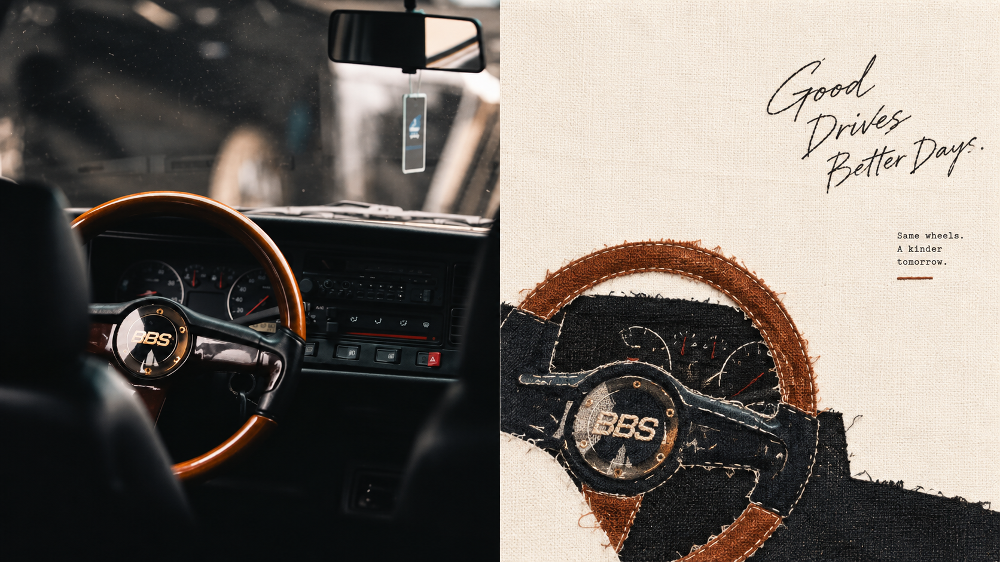
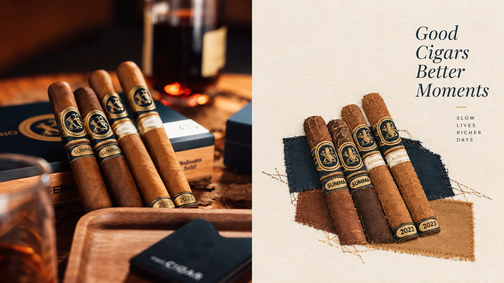
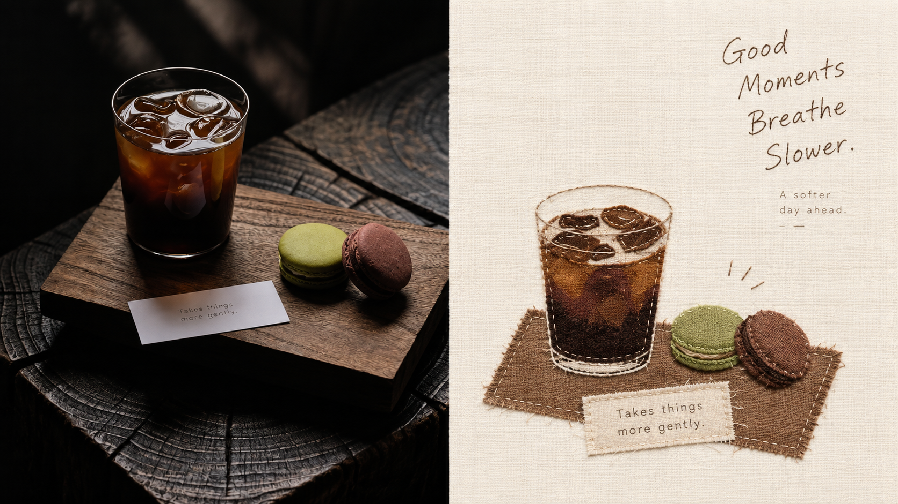
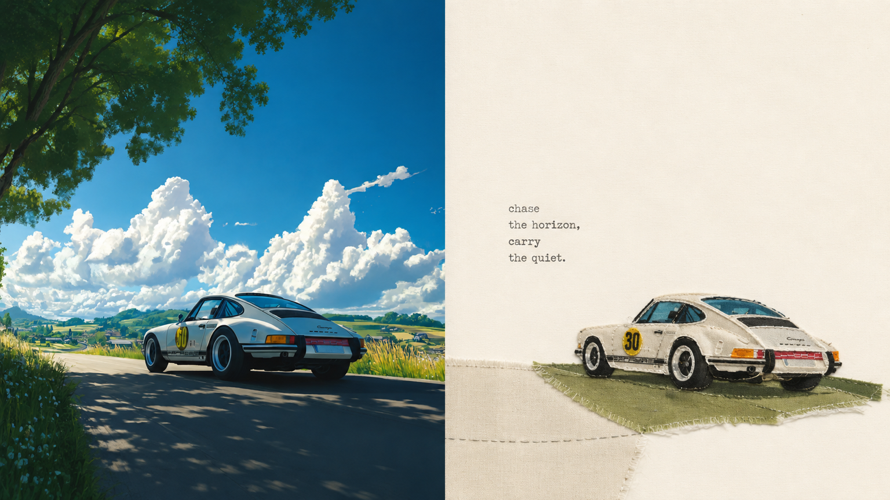
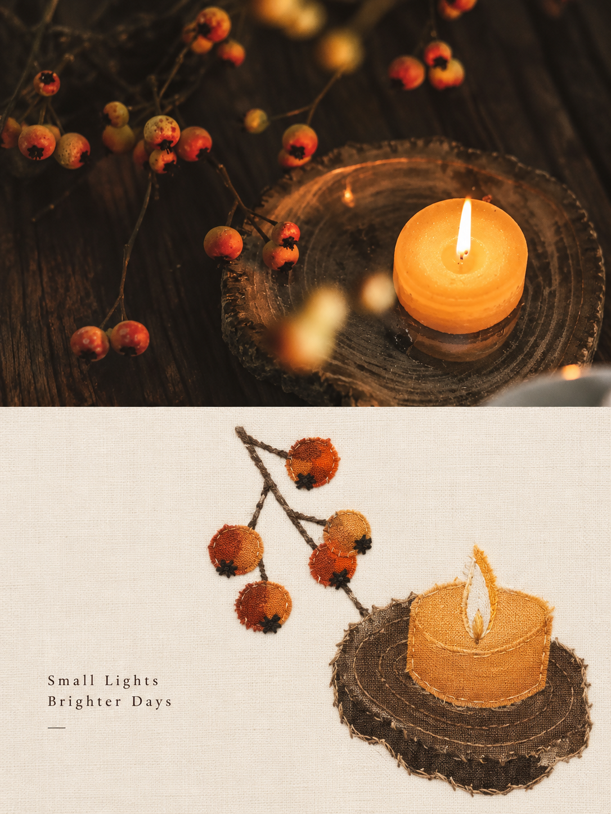
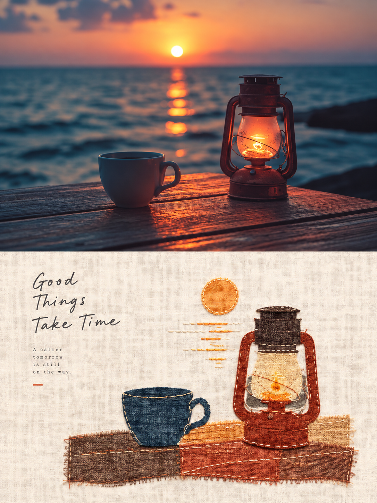
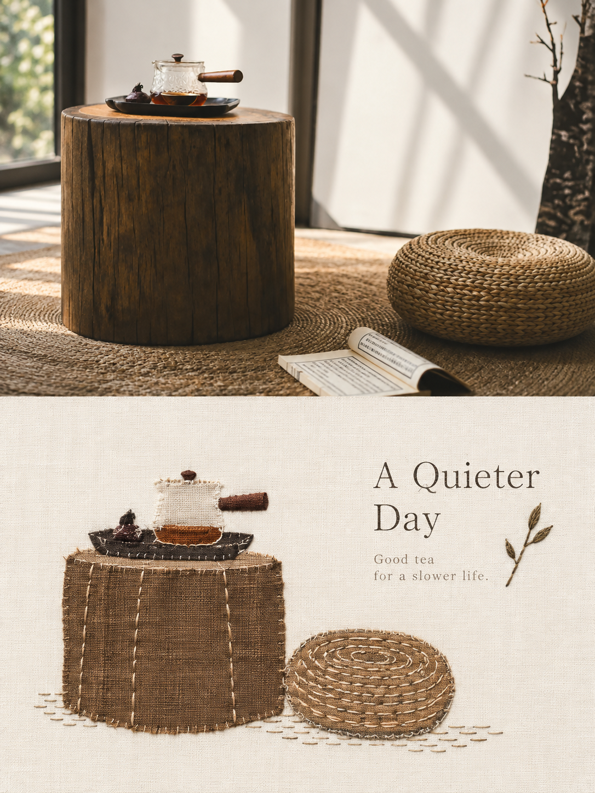
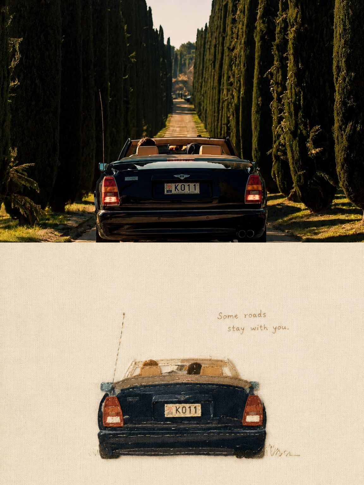

<div align="center">

# XXD Panel 119｜손바느질 직물과 여백 기록

적은 천 조각과 바늘땀으로 사진의 따뜻한 기억을 남깁니다.

<a href="README.md">简体中文</a> · <a href="README.en.md">English</a> · <a href="README.ja.md">日本語</a> · <strong>한국어</strong> · <a href="README.ar.md">العربية</a>

</div>

## 샘플 작품

本项目已发布 8 张实际样片，图片文件位于 `assets/examples/`。

| sample-05 | sample-07 | sample-09 | sample-11 |
| --- | --- | --- | --- |
|  |  |
| sample-07 | sample-08 |
|  |  |
| sample-09 | sample-10 |
|  |  |
| sample-11 | sample-12 |
|  |  |

## 잘 맞는 상황과 해결하는 문제

인상적인 사람, 사물, 동작은 남기고 싶지만 배경이 복잡할 때 **Panel 119**는 핵심 이미지를 손바느질 텍스타일 콜라주로 정제합니다. 소수의 큰 천 조각, 올이 풀린 아플리케와 소량의 자수가 작은 초점을 이루고, 매우 넓은 여백이 섬유와 바늘땀을 드러냅니다.

### 이런 경우에 적합합니다

- 인물, 일상 사물, 여행 기억의 정체성을 지키며 따뜻한 직물 촉감을 더하고 싶을 때.
- 주체, 윤곽, 구조, 자세, 서사적 관계만 추출하고 사물마다 옮겨 그리기는 피하고 싶을 때.
- 생생하고 부드러운 2–4색 직물과 절제된 편집 문구를 조합하고 싶을 때.
- 상하, 좌우, 디자인 전용, 여러 크기, 4기기 배경화면, 폴더 일괄 출력이 필요할 때.

### 해결하는 것

- 배경과 무관한 세부 대부분을 삭제해 정보 과잉을 막습니다.
- 소수의 큰 천 조각과 손바느질로 식별성을 만들고 값싼 수공예와 틀에 박힌 콜라주를 피합니다.
- 비교 화면은 정확히 두 50:50 영역만 사용하며 제목 띠, 하단 띠, 제3영역을 만들지 않습니다.
- 현재 원본에서 한 번에 직접 생성하여 중간 결과의 반복 스타일 변환을 방지합니다.

## 원본 프롬프트 · 5개 언어

[简体中文](references/original-prompt/zh-CN.md) · [English](references/original-prompt/en.md) · [日本語](references/original-prompt/ja.md) · [한국어](references/original-prompt/ko.md) · [العربية](references/original-prompt/ar.md)

중국어 파일은 사용자 원문을 그대로 보존하며 런타임의 유일한 창작·미학 권위입니다. 다른 네 언어는 완전하고 충실한 열람용 번역이며 생성 원문을 대체하지 않습니다.

**핵심 특징:** 선택적 정제 · 손바느질 텍스타일 콜라주 · 면·리넨 섬유 · 올이 풀린 아플리케 · 소량의 자수 · 2–4색 · 매우 풍부한 여백 · 편집형 타이포그래피

## 빠른 적합성 확인

| 궁금한 점 | Panel 119의 답 |
|---|---|
| 추상화 후 원본을 알아볼 수 있는가 | 주체, 자세, 서사적 관계를 우선하여 소수의 천 형태로 정제합니다. |
| 직물이 화면을 가득 채우지 않는가 | 작은 초점을 두고 여백, 천 가장자리, 바늘땀으로 리듬을 만듭니다. |
| 색이 침울해지지 않는가 | 원본의 따뜻한 2–4색을 적당히 밝히고 맑게 하며 회색기를 덜어냅니다. |
| 출력 방향을 바꿀 수 있는가 | 네 모드와 여러 크기에서 미학은 유지하고 출력 구조만 바꿉니다. |

## 사진을 결과물로 바꾸는 흐름

주체와 서사적 관계 파악 → 배경 대부분 삭제 → 소수의 큰 천 조각과 간단한 실루엣으로 재구성 → 겹침, 올이 풀린 가장자리, 소량의 바늘땀 추가 → 초점을 줄이고 넓은 여백으로 구성 → 소량의 문구를 조용히 배치.

## 완성작의 식별 특징

- 사진의 정체성, 구조, 자세, 자연광과 색 분위기를 유지하며 가볍게만 보정합니다. 배경을 확장할 수 있지만 주체를 늘이지 않습니다.
- 필수 정보만 남기고 사물 하나하나나 전체 장면을 복제하지 않습니다.
- 면·리넨 섬유, 천의 결, 불규칙한 재단, 약간의 어긋남, 올이 풀린 아플리케와 소량의 자수로 촉감을 만듭니다.
- 주체는 비대칭, 가장자리 배치, 부유, 부분 크롭이 가능하며 매우 넓은 여백이 구도를 이룹니다.
- 원본에서 뽑은 2–4색은 생생하고 부드럽고 친근하며 탁하거나 낡거나 침울한 색을 피합니다.
- 주체, 장소, 행동, 감정, 은유에서 나온 적은 글자를 여백이나 주체 가장자리에 놓으며 특정 글꼴이나 언어를 고정하지 않습니다.

## 네 가지 출력 모드

- `top-bottom`: 전폭 상하 두 영역만 사용합니다. 실제 사진은 위, 디자인은 아래에 정확히 50%씩 둡니다.
- `left-right`: 전고 좌우 두 영역만 사용합니다. 실제 사진은 왼쪽, 디자인은 오른쪽에 정확히 50%씩 두며 상하 구도로 돌리지 않습니다.
- `design-only`: 전체 캔버스에 Panel 119의 디자인 번역만 표시하고 사진은 보이지 않는 참고 자료로 사용합니다.
- `wallpaper-pack`: 휴대폰, iPad, 데스크톱, 시계용 완성 이미지를 각각 만들며 `linked` 또는 `independent`를 선택합니다.

모드와 크기는 여러 개 선택할 수 있습니다. `1:1`, `3:4`, `4:3`, `4:5`, `5:4`, `2:3`, `3:2`, `9:16`, `16:9`, `21:9`, `5:7`, `7:5`, 정확한 픽셀을 지원합니다. 텍스트는 모델 생성, 사용자 원문, 없음 중에서 선택합니다. 폴더 입력은 각 소스를 분리 처리하고 최종 PNG를 하나의 새 작업 폴더에 평면으로 저장합니다.

## 시작하기

```bash
git clone https://github.com/nevertoday/xxd-panel-119.git
npx skills add https://github.com/nevertoday/xxd-panel-119 --skill xxd-panel-119
```

설치 후 Agent 세션을 다시 시작하고 `$xxd-panel-119`을 호출하세요. 사용자 단위 Codex 설치에는 `--global --agent codex --yes`를 추가할 수 있습니다.

```text
/xxd-panel-119 photo.jpg --mode top-bottom --size 3:4 --text prompt --locale ko-KR
/xxd-panel-119 photo.jpg --mode left-right --size 16:9 --text prompt --locale en-US
/xxd-panel-119 photo.jpg --mode design-only --size 9:16 --text none
```

전체 실행 계약은 [SKILL.md](SKILL.md), 런타임 어댑터는 [영어](references/xxd-panel-119-prompt.en.md)와 [중국어](references/xxd-panel-119-prompt.zh-CN.md)를 확인하세요.

<!-- xxd-readme-ads:start -->
## XXD 소개

XXD는 Xiaoxiaodong 브랜드 이름의 약자입니다. 제작 및 유지관리: [@xiaoxiaodong01](https://x.com/xiaoxiaodong01).

## 지원과 멤버십

> **광고 안내:** 이 섹션의 QR 코드와 유료 멤버십·서비스 링크는 XXD의 홍보 정보입니다. 스캔이나 구매는 선택 사항이며, 오픈 소스 이용에는 영향을 주지 않습니다.


<!-- xxd-panel-command-system:start -->

모든 장군 Skills는 연 CNY 699 통합 멤버십에 포함되며 별도 구매가 필요하지 않습니다.

| 등급 | Skill | 역할 |
|---|---|---|
| **장군급** | [`xxd-panel-all`](https://github.com/xiaoxiaodong-ai/xxd-panel-all) | 사용 가능한 번호형 Skills 탐지, 이미지·주제·용도별 추천, 번호 지정 파견, 동일 입력의 여러 스타일 시안, 이미지 폴더의 일괄 배정과 개별 작업 파견. |
| **병사급** | `xxd-panel-NNN` | 각 번호가 고유한 원본 프롬프트와 미학만 실행해 장군이 배정한 하나의 작업을 완성합니다. |

<!-- xxd-panel-command-system:end -->

### 지식성구＋회원 프롬프트 라이브러리＋모든 장군 Skills 멤버십 · CNY 699/년

[지식성구](https://wx.zsxq.com/group/15554814142882), [XXD 회원 프롬프트 라이브러리](https://vip.xiaoxiaodong.ai/), 모든 장군 Skills 멤버십은 하나의 회원권입니다. **연회비를 한 번 결제하면 세 가지 혜택을 모두 이용할 수 있으며 추가 구매는 필요하지 않습니다.**

[Knowledge Planet](https://wx.zsxq.com/group/15554814142882) · [Member Prompt Library](https://vip.xiaoxiaodong.ai/)

<p align="center"><a href="https://xiaoxiaodong.pages.dev/assets/wechat-qr.png"></a></p>
<!-- xxd-readme-ads:end -->

## 라이선스

이 프로젝트(Skill, 프롬프트, 스크립트, 문서, 함께 제공되는 샘플 이미지 포함)는 **PolyForm Noncommercial License 1.0.0**을 따릅니다. 전체 법률 문구는 [LICENSE](LICENSE), 공식 페이지는 <https://polyformproject.org/licenses/noncommercial/1.0.0>에서 확인하세요.

쉽게 말하면 다음과 같습니다.

- 개인은 학습, 연구, 실험, 테스트, 취미 프로젝트, 사적 오락에 사용할 수 있습니다. 자선 단체, 교육 기관, 공공 연구·안전·보건 기관, 환경보호 단체, 정부 기관도 사용할 수 있습니다.
- **비상업적 목적**이라면 사용, 복사, 수정, 파생 작업 제작, 공유가 가능합니다. 공유할 때는 이 라이선스(또는 위 링크)와 저자가 제공한 모든 `Required Notice:` 문구를 함께 제공해야 합니다.
- 상업 제품이나 서비스, 유료 납품, 접근권 또는 라이선스 판매, 상업적 적용으로 이어질 것으로 예상되는 용도에는 사용할 수 없습니다. 상업적으로 사용하려면 저작권자에게 별도의 서면 허가를 받아야 합니다.
- 이 계약은 명시된 저작권 라이선스와 제한된 특허 라이선스만 부여합니다. 상표, 브랜드명 또는 명시되지 않은 다른 권리를 부여하지 않으며 라이선스를 제3자에게 재허여할 수도 없습니다.
- 서면으로 위반 통지를 받으면 32일 안에 준수 상태로 돌아가고 실질적인 시정 조치를 해야 하며, 그렇지 않으면 라이선스가 즉시 종료됩니다. 특허 침해를 서면으로 주장해도 특허 라이선스가 종료됩니다.
- 콘텐츠는 법이 허용하는 범위에서 어떠한 보증도 없이 “있는 그대로” 제공됩니다. 사용에 따른 위험과 잠재적 손실은 사용자가 부담합니다.
